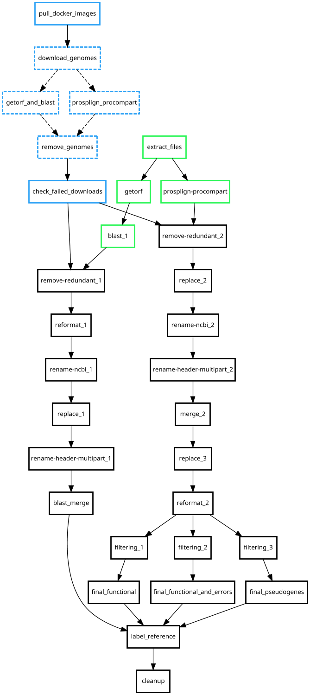

# SEDA-Compi `gene-evolution` [](https://github.com/sing-group/compi-rnaseq-pipeline) [](https://github.com/sing-group/seda-compi-gene-evolution) [](https://hub.docker.com/r/pegi3s/seda-compi-gene-evolution) [](https://www.sing-group.org/compihub/explore/5d09fb2a1713f3002fde86e2)

A SEDA-Compi pipeline to study gene evolution using getorf/BLAST and ProSplign-ProCompart.

A Docker image is available for this pipeline in [this Docker Hub repository](https://hub.docker.com/r/pegi3s/seda-compi-gene-evolution).

## Table of contents

- [Pipeline overview](#pipeline-overview)
- [Using the `gene-evolution` pipeline image in Linux](#using-the-gene-evolution-pipeline-image-in-linux)
  - [Initialize the working directory](#initialize-the-working-directory)
    - [Input data](#input-data)
    - [`query` and `query1`](#query-and-query1)
- [Running the pipeline with sample data](#running-the-pipeline-with-sample-data)
- [Advanced options](#advanced-options)
  - [Compi execution parameters](#compi-execution-parameters)
    - [Run a single task with 2 maximum parallel executions](#run-a-single-task-with-2-maximum-parallel-executions)
    - [Partial execution between two tasks](#partial-execution-between-two-tasks)
  - [Skipping the ProSplign-ProCompart branch](#skipping-the-prosplign-procompart-branch)
  - [Controlling genome downloads](#controlling-genome-downloads)
- [Troubleshooting](#troubleshooting)
- [Publications](#publications)

## Pipeline overview

The image below shows an overview of the pipeline. It is important to note that there are two alternative  ways of starting the pipeline and reach the two main branches:
- Green: Through `extract_files` starting with a set of downloaded files located at the input directory as explained below.
- Blue: Through `download_genomes`, starting with a list of accessions located at the input file especified below. This alternative is aimed at reducing disk space as genomes are removed from disk after being analyzed by `getorf_and_blast` and `prosplign_procompart`.

Also, note that the ProSplign-ProCompart branch (starting either in `prosplign_procompart` or `prosplign-procompart`), is executed by default but it can be disbled as explained before.



## Using the `gene-evolution` pipeline image in Linux

To perform an analysis, users must first:

1. Initialize a working directory with the files required by the pipeline.
2. Add the input data to be analyzed.
3. Configure the pipeline parameters.

This section provides a comprehensive guide on how to perform these steps and describes the tools and scripts included in the pipeline image to do so easily.

### Initialize the working directory

To start a new analysis, the first step is to build the directory tree in your local file system. This directory tree will be referred to as the working directory, and its structure is recognized and used by the pipeline during the analysis. As an alternative to start, next subsection explains how to download a sample dataset to start with an analysis-ready working directory.

To build the working directory, adapt the first line of the following code and run it:
```sh
WORKING_DIRECTORY=/path/to/the/working-directory

mkdir -p ${WORKING_DIRECTORY}

docker run --rm \
    -v ${WORKING_DIRECTORY}:${WORKING_DIRECTORY} \
    -u "$(id -u)":"$(id -g)" \
    --entrypoint=/bin/bash \
        pegi3s/gene-evolution:0.2.0 \
            init_working_dir.sh ${WORKING_DIRECTORY}
```

After running this command, the selected working directory should have the following structure:
```
sample-working-dir/
├── compi.params
├── input/
├── params/
├── query
├── query1
├── pipeline.png
├── README.txt
└── run.sh
```

Where:
- `compi.params` contains the Compi parameters.
- `input` is a directory to put the input data.
- `params` is a directory that contains the default SEDA operations' parameters.
- `query` and `query1` are the two FASTA files used as input in the pipeline.
- `pipeline.png` contains the pipeline graph.
- `README.txt` contains the next steps you need to follow to run the analysis.
- `run.sh` is the script to run the analysis.

#### Input data

As explained previously, there are two ways of starting the pipeline:
1. Through `extract_files` starting with a set of downloaded files that must be provided at `input/extract_files/`. These are the CGA/CGF zipped files as they are downloaded from NCBI.
2. Through `download_genomes`, starting with a list of accessions that must be provided at `input/accessions_list.txt`. See [controlling genome downloads](#controlling-genome-downloads) for more details.

#### `query` and `query1`

The `query` FASTA file is used for BLAST and the `query1` FASTA file is used for ProSplign-ProCompart. They are referenced in `params/blast_1.cliParams` and `params/prosplign-procompart.cliParams` respectively.

Note that headers in the `query` must follow the format `>Gene Description`, for instance:
```
>FOXD2 XP_016006825_2
>D1B XP_015992634_2
>mesogenin1 XP_016009398_2
```
If not, the pipeline will fail to produce the correct outputs.

## Running the pipeline with sample data

It is possible to test the pipeline using our sample data available [here](). Download this ZIP file and decompress it in your local file system. Then, to execute the pipeline using Docker, run the following command changing the `/path/to/seda-compi-gene-evolution/` to the path where you have the decompressed data.

```bash
./run.sh /path/to/seda-compi-gene-evolution
```

Pipeline results will be created in a directory called `results` inside the working directory and intermediate files will be stored at `output`.

## Advanced options

### Compi execution parameters

The pipeline execution can be customized (e.g. setting the maximum number of parallel tasks, partial executions, and so on) by providing an additional parameter to the `run.sh` script. Below are some examples:

#### Run a single task with 2 maximum parallel executions

```bash
./run.sh /path/to/working-directory "--single-task extract-files --num-tasks 2"
```

#### Partial execution between two tasks

```bash
./run.sh /path/to/working-directory "--from getorf --until blast_merge"
```

### Skipping the ProSplign-ProCompart branch

The ProSplign-ProCompart branch is executed by default but the execution fo its associated tasks can be ommited by including the `skip_prosplign_procompart` flag in the `compi.params` file.

### Controlling genome downloads

As explained earlier, the `download_genomes` task is designed to save disk space by removing genomes after they are analyzed by `getorf_and_blast` and `prosplign_procompart`. The task starts with a list of accessions located at `input/accessions_list.txt`.

If there are `X` accessions in the list, Compi will launch up to `X` instances of `download_genomes` (one per accession). Thus, the pipeline must be run with `--num-tasks X`, otherwise not all accessions will be processed.

Then, the pipeline parameter `max_tasks` controls how many accessions can be downloaded and processed simultaneously by the subsequent tasks (`getorf_and_blast` and `prosplign_procompart`).

If `max_tasks = 1` (default), all remaining tasks will be paused at `download_genomes`—before any download begins—until another genome finishes processing and is removed by `remove_genomes`. In this way, at most `max_tasks` genomes are stored at once, preventing excessive disk usage. To change it, set it explicitly in the `compi.params` file.

## Troubleshooting

| Problem | Possible cause |
| ------- | -------------- |
| `download_genomes` tasks do not all start | `--num-tasks` lower than number of accessions in `input/accessions_list.txt` |
| `check_failed_downloads` reports failed accessions | Network/transient NCBI issue or accession deprecated |
| `results/gene_sequences` contains a single FASTA file | The `query` file headers do not follow the requirements (`>Gene Description`) |
| `results/gene_sequences` contains filenames that do not correspond to a gene name (e.g. `mesogenin1_GCA_004027595.1_DinBra_v1_BIUU_genomic.fna.sequences.fasta` instead of `mesogenin1.fasta`) | There was an error retrieving the taxonomic information at `rename-ncbi_1`, try re-running the pipeline from that point (with `--from rename-ncbi_1 --until label_reference`) after removing the affected output directories (`cd /path/to/working_dir && rm -rf output/rename-ncbi_1 output/replace_1 output/rename-header-multipart_1 output/blast_merge results`) |


## Publications

- C. P. Vieira; H. López-Fernández; M. Reboiro-Jato; J. Vieira (2025) GULO evolution in bats: a genomic approach. 19th International Conference on Practical Applications of Computational Biology & Bioinformatics: PACBB 2025. Lille, France. 25 - June
